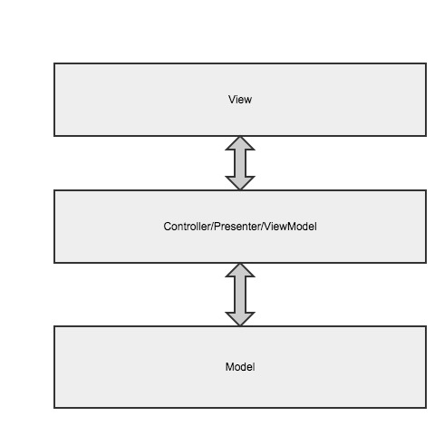

AndroidPi
==================
This project is about experiments and explorations of android application development, targeting at application architecture, test driven development, design pattern, etc. , mainly about software engineering in practice.

[Readme中文版](/README.md)

## MVP or MVVM，which one to choose？
So far, the architectures I have used in my work are event bus pattern(with Otto library) and MVP, and I have spend some time on my toy projects using the clean architecture and MVVM.There are also many open source project about android application architecture patterns:
- [Android application architecture blueprint](https://github.com/googlesamples/android-architecture)
- [Clean architecture sample](https://github.com/android10/Android-CleanArchitecture)

And now, in addition to building a architecture with third party libraries, we can use the official architecture components:
- [Android architecture guide](https://developer.android.com/topic/libraries/architecture/guide.html#testing)
- [Android architecture components sample](https://github.com/googlesamples/android-architecture-components)

There are so many architecture patterns, how can we make a good choice? Well, the recommendation is choosing as needed. For tiny projects, there is no need to build a architecture. And medium and large project should not be over designed. 

## Concepts
Why we need these architecture and how to choose one? Firstly, some concepts about these architecture should be understood clearly. MVC was proposed first, now we have the MVP, MVVM, etc. Among them, the are two layers that don't change that much, the **model** layer and **data** layer.

### Business
Business is the services provided by our application. It can be remote service provided in the form of local service, and be standalone local service.

### View
View is the user interface of buiness. It provide buiness operation and presentation interfaces for users. The user is not specified to be human, it can be a message, eg. a external push service can interact with buiness with message interfaces, therefore, the user interfaces don't need to be visiable with human eyes.

### Model
Model is abstruction and modeling of buinesses in software engineering. It provided all the data entities and states needed by buiness, and the interfaces to manage these entities and states, the interface implementation is commonly simple data accessing and state changing utilities.

### Domain
A domain is a independent application. Different applications belong to different domains. It contains the abstruction of model and model interaction（the interaction here is not the abstruction of view）, thus, it doesn't specify concrete model implementation and user interfaces.

## The domain architecture

The main idea of the architecture is derived from the clean architecture, it's basicly the clean architecture when the **Interface** is placed with **UserCase**. So, what's the difference and refinement for android development? In the clean architecture sample link above and some of my work on applying it, I find if the Domain is a pure Java library, I need to difine corresponding entity classes in each layer, and using mapper to transform these entity to the domain entity or vice versa. That will introduce huge work and complexity to our project. Although the origin clean architecture can completely decoupe each layer, but obversely, this Java library generally will not used in non-android platform, there is little point to do like this. Another point is it's too redundant to use **UserCase** to do interaction. Beside, we have reactive programming libraries that based on observer pattern like RxJava and LiveData, there is no need to write large amount of callback interfaces when interacting between model and view.

In this project, the entity classes in domain and data layer is consistent. And `Usercase` is not used for interaction, replaced by invoking interfaces directly and return the observable to update the `View`.

This `Domain` based pattern is very flexible and extensible, the `Domain` interfaces can be called directly from `View`, and extra layers can be added between them, like Presenter/Controller/ViewModel layers. It inherits the advantages of layering and decouping from Clean architecture, which is easy for writing tests. It fits in both tiny projects and the big ones.

## Implementation

The `Domain` layer is unrelated with specific implementation, user oriented interfaces can be defined here and implemented in the `Data` layer. The `Data` layer has `Dao` interfaces to access entities and API interfaces to access remote service, the repository pattern can be applied to hide the access details, thus the `Data` will have a additional `Repository` layer. If implemented in this way, there will be two layers between between `View` and `Model`, i.e. the domain user interface and repository interface, it's a bit of redundant. 

There is a granularity problem here, the granularity can be considered as the amount of work to do by a specific interface method, if the granularity of `Domain` interfaces and `Data` interfaces are consistent, they can be merged. In practice, unless we can determine the the granularity of the interfaces of the two layers, the is little point to seperate them apart, and it's also not practical, because if the buiness changes frequently so does the `Domain` interfaces, it's impossible to finish this work before coding. Therefore, we can meger these two interfaces at the beginning. And we don't want change `Data` interfaces when the buiness changes, otherwise the decouping between them will be meaningless, thus the `Repository` interfaces can be removed from `Data` layer or promoted as the `Domain` layer interfaces.
