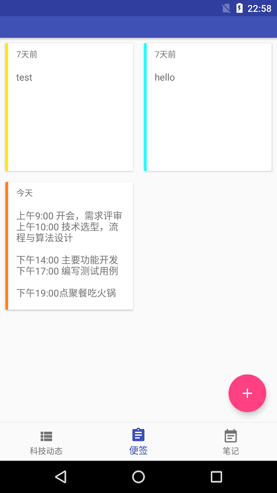

AndroidPi
==================

一个对Android应用开发相关技术的探索与实验性项目，包括应用架构、测试驱动开发、设计模式等方面，主要与工程实践相关。
也会对最新的开发技术和工具进行研究与应用，如插件化、AOP、混合APP等。对于流行的技术热点也会有所涉及，如AI、自然语言处理之类。

------------------------------
 |  | 
---------|--------|-----------

## 功能
1. 科技趋势，使用一个爬虫定时爬取科技和互联网相关的资讯
2. 便签，便签主要用于记录待办事项、简短的备忘录等等
3. 笔记，一个简单的笔记本工具

## 需求与计划
- 个人的数据由个人保管，现在有很多的便签和笔记应用，都具有在线和多设备同步的功能，但这里的考虑是将个人数据放到第三方服务器
虽然比较方便，但并不能使人完全放心。因此便签和笔记不会同步到任何第三方服务器。但数据导出和同步的需求还是有的，计划开发一个
运行在个人电脑或个人服务器的服务端以进行便签和笔记等个人数据的同步和保存。
- 笔记本
    + 加入对照片的支持
    + 加入对Markdown的支持，将markdown格式的笔记转换为HTML文档进行展示。

