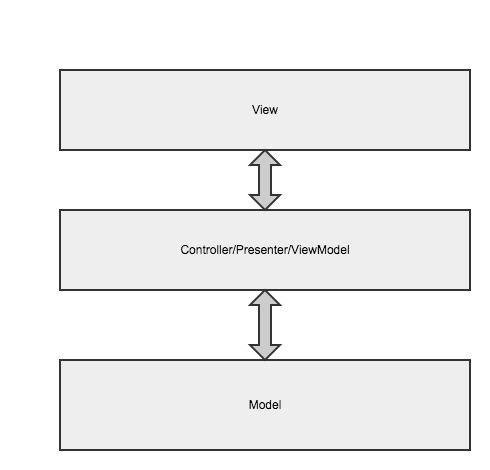
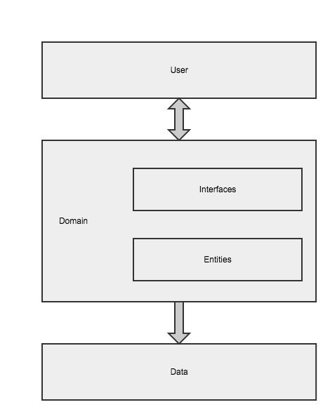

AndroidPi
==================

这是一个对Android应用开发技术的探索与实验性项目，主要研究包括应用架构、测试驱动开发、设计模式等方面的内容，大多都是与工程实践相关。

[Readme English Version](/README-en.md)

## MVP与MVVM，该选哪一个？
目前为止，我在工作中用过的应用架构有基于Otto的总线模式和MVP模式，业余时间使用Clean架构和MVVM做过一些开发。对于这些模式有一些很好的开源项目可以参考:
- [Google应用架构蓝图](https://github.com/googlesamples/android-architecture)
- [Clean结构示例](https://github.com/android10/Android-CleanArchitecture)

对于架构的搭建，除了采用第三方库以外，还可以使用Google官方的应用架构组件：
- [Android应用架构组件指南](https://developer.android.com/topic/libraries/architecture/guide.html#testing)
- [架构组件示例](https://github.com/googlesamples/android-architecture-components)

架构这么多，应该怎么选择？建议根据项目实际情况作出选择，如果只是一个小的玩具项目，可以不用任何架构，大的项目也不应该陷入了过度设计的误区。

## 概念
为什么需要这些架构以及怎么选择？首先要明确这些架构中的几个概念。从MVC被提出以来，发展到如今的MVP，MVVM等等，所有这些架构中有两个层都没有变化，那就是模型（Model）和视图（View）。

### 业务
业务是应用所提供的服务。可以是后端远程提供的服务以本地化的方式展现，也可以是单独的本地服务。

### 视图
视图是业务的用户界面（user interface）。它为用户提供操作和展示业务的接口，用户不一定是人，也可以是消息，例如一个外部的推送服务，它通过消息接口与业务交互，所以界面也不一定是肉眼可见的界面。

### 模型
模型是对业务在软件工程中的抽象与建模。它提供了开展所有业务需要数据实体和状态，以及管理这些数据和状态的接口。具体实现中一般是简单的数据访问与状态改变。

### 领域
一个应用领域指一个独立完整的应用。不同的应用属于不同的领域。它包含了对模型和以及与模型交互的抽象（这里与模型交互的抽象不是指对视图的抽象），一般不涉及具体的实现和具体的用户界面。

## 领域架构

这一架构主要是根据Clean架构的思想得来的，如果将Interface替换为UserCase那基本上就是Clean架构了。那么有何改进和区别，在上面链接的示例以及实际使用Clean架构中发现，如果使Domain完全成为一个Java库，然后在各个层之间定义对应的实体进行转换会增加大量的工作和复杂度。虽然说这样是为了达到完全的解耦，但很明显，这个Java库一般并不会用到非Android平台中，这样做的意义不大。还有一点是UserCase的使用过于冗余了，并且现在有了RxJava和LiveData这样的基于观察者模式的响应式编程库，在模型和视图的交互中，不用再编写大量的回调接口。

本项目中的Domain层中的实体和Data层中的实体是一致的。并且本项目中不使用UserCase来进行交互，而是直接调用接口，然后从返回的被观察者更新视图就可以了。

这种基于Domain的模式是十分灵活和易于扩展的，即可以直接从View调用Domain中的接口，也可以在这两者间添加Presenter/Controller/ViewModel层。它仍具有Clean架构中分层的和解耦方面的优点，易于编写测试。可以说这种方式即适用于小型项目，也适用于中大型项目。

## 实现
Domain层是无关具体实现的，可以专门定义面向用户的接口，然后在Data层中实现。Data层中有实体对象访问的Dao和访问服务器的API等接口，并且可以采用仓储模式来隐藏访问的细节，这样Data中会多一层Repository接口。如果这样实现，视图和模型间会有用户接口和仓储接口这两层接口，显得有点冗余了。

这里有一个接口粒度的问题，可以认为是一个接口方法调用所需要完成工作的量，如果Domain中的接口粒度和Data仓储接口粒度一致，那么可以将两者合并。实际中发现，除非能够在应用开发前就确定两种接口的粒度大小，不然将它们两者分别实现没有太大的意义，但这样做不太现实，因为如果业务频繁地变更，Domain的接口也随之改变，无法在开发之初就完成这项工作。因此一开始将两种接口合并就好了，并且我们不希望业务变化时Data的接口也频繁地变化，不然两层之间的解耦就没有意义了，那么可以从Data层中去掉Repository接口，或者将其提升为Domain层的用户接口。
